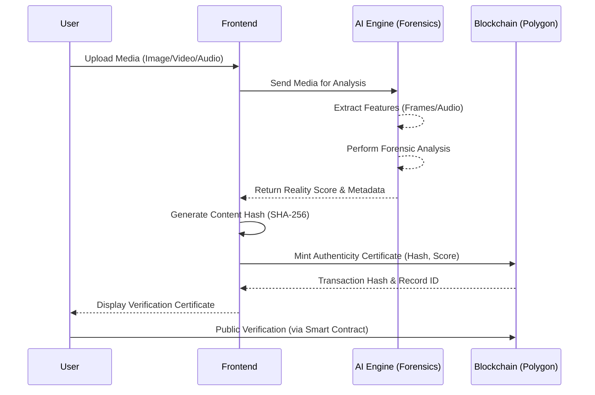
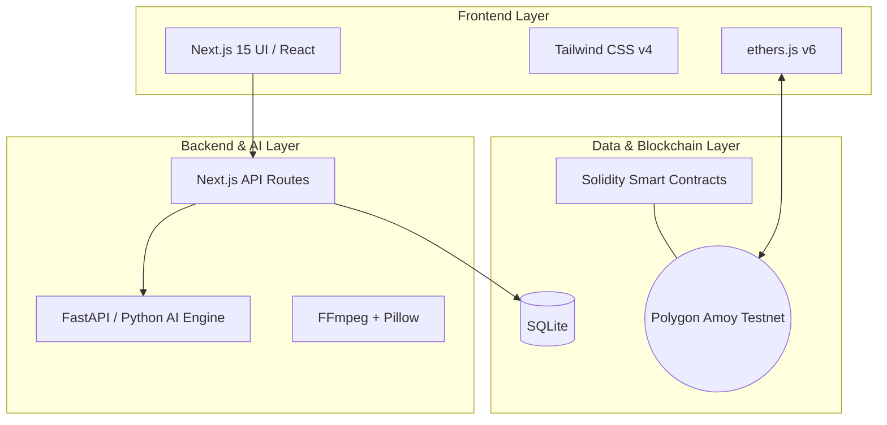

# 🛡️ VISTA - Proof-of-Reality Network

**Blockchain + AI Digital Authenticity Platform**

> "In the AI era, seeing is no longer believing. VISTA Proof-of-Reality creates a trust layer for digital content."

VISTA is a cutting-edge platform that combines **AI forensic analysis** with **blockchain verification** to create tamper-resistant authenticity certificates for digital content. By bridging the gap between deepfake detection and immutable ledgers, VISTA ensures that content integrity can be publicly verified and trusted.

---

## 🏗️ Architecture & Flow

### System Flowchart



### Tech Stack Architecture



---

## 💻 Technology Stack

| Layer | Technology | Purpose |
|:---|:---|:---|
| **Frontend** | Next.js 15 + React + TypeScript | Modern web application framework |
| **UI** | Tailwind CSS v4 | Utility-first styling and interface |
| **Backend API** | Next.js API Routes | Upload handling, analysis routing, blockchain prep |
| **AI Engine** | Python + FastAPI | Forensic analysis microservice |
| **Media Processing**| FFmpeg + Pillow | Frame/audio extraction for deepfake detection |
| **Blockchain** | Polygon Amoy (Solidity) | Immutable verification records |
| **Web3** | ethers.js v6 | Blockchain interaction & contract calls |
| **Database** | SQLite | Local verification history storage |

---

## 📁 Project Structure

```text
helptime/
├── frontend/          # Next.js 15 web application (React, Tailwind, ethers.js)
├── ai-engine/         # Python FastAPI forensic analysis service
├── blockchain/        # Hardhat + Solidity smart contracts (Polygon)
└── .env.example       # Environment variables template
```

---

## 🚀 Quick Start Guide

### 1. Blockchain Setup

```bash
cd blockchain
npm install
npx hardhat compile
npx hardhat test

# Deploy to Polygon Amoy (requires private key in .env)
npx hardhat run scripts/deploy.js --network amoy
```

### 2. AI Engine Setup

```bash
cd ai-engine
pip install -r requirements.txt
python main.py
# Runs on http://localhost:8000
```

### 3. Frontend Setup

```bash
cd frontend
npm install
npm run dev
# Runs on http://localhost:3000
```

---

## 🔐 Environment Setup

To run the project locally, you need to configure your environment variables:

1. Copy `.env.example` to `.env` in the root folder, or set them up in each respective project folder.
2. Add your **MetaMask private key** (for blockchain deployment).
3. Get testnet **POL** from the [Polygon Faucet](https://faucet.polygon.technology/).
4. Set the deployed smart contract address in the frontend `.env` after deploying.

---

## 👥 Team

Built for hackathon — **VISTA Proof-of-Reality Network**
